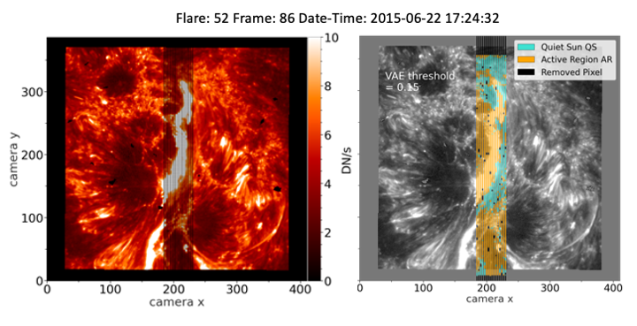
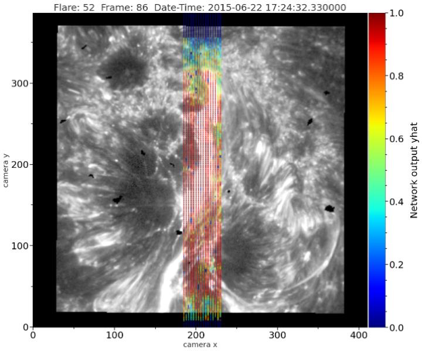

# IRIScast
A repository containing the code used in the study 'Which of the IRIS spectral lines, Mg II, Si IV, or C II is best for short-term solar flare prediction?'. The models input layers can be freely adjusted to accomodate for your own custom dataset.

We provide two main notebooks, one with a data example to train and test a VAE on preprocessing observations from IRIS and remove quiet sun like spectra called VAE_smlbook.ipynb. The other one to train and test models with 4 different architectures called k_fold_model_run_MgIIk-Example_notebook.ipynb. Since the data is too large to be provided on github it can be requested but is not provided here. 

One can find additional functions important for the models to train, the data to be loaded and preprocessed in the files utils.py, utils_models_MgIIk.py, and utils_features.py. An overview of how the pixels of the IRIS slit are categorized in a preflare observation as active region or quiet sun type spectra is depicted in the following figure:

An example of the yhat probability outputs of our trained models for Mg II h&k is presented here:

The required libraries to run the notebooks are in requirements.txt and can be installed with pip install -r requirements.txt
